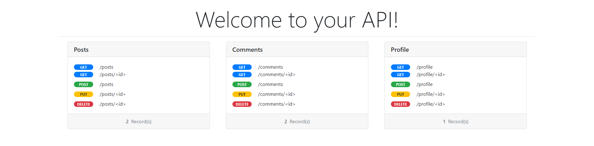

# JSON Server (Python version)


This code tries to bring a [json-server](https://github.com/typicode/json-server) implementation to the python community with room for improvement.

Get a full fake REST API with __zero coding__ in __less than 30 seconds__ (seriously)

Created with :heart: for front-end developers who need a quick back-end for prototyping and mocking and use Python instead of Javascript.

* [json-server [Javascript implementation] (Original)](https://github.com/typicode/json-server)


<p>&nbsp;</p>


## Table of contents

<!-- toc -->

- [Getting started](#getting-started)
- [Routes](#routes)
  * [Filter](#filter)
  * [Sort](#sort)
  * [Slice](#slice)
  * [Operators](#operators)
  * [Relationships](#relationships)
  * [Homepage](#homepage)


<!-- tocstop -->

## Getting started

Install JSON Server 

```
git clone https://github.com/RodrigoProjects/json-server.py
```

Install Flask with pip

```
pip install Flask
```

Create a `db.json` file with some data

```json
{
    "posts": [
        {
            "id": 1,
            "title": "json-server",
            "author": "typicode",
            "views" : 300
        },
        {
            "id": 2,
            "title": "json-server 2",
            "author": "spln",
            "views" : 50
        }
    ],
    "comments": [
        {
            "id": 1,
            "body": "some comment",
            "postId": 1,
            "author": {
                "name": "typicode"
            }
        },
        {
            "id": 2,
            "body": "some comment",
            "postId": 1,
            "author": {
                "name": "teste"
            }
        }
    ],
    "profile": 
        {
            "name": "typicode"
        }

}
```

Start JSON Server

```bash
python3 json-server/main.py json-tests/db.json 3000
```

Now if you go to [http://localhost:3000/posts/1](http://localhost:3000/posts/1), you'll get

```json
{ "id": 1, "title": "json-server", "author": "typicode" }
```

Also when doing requests, it's good to know that:

- If you make POST, PUT, PATCH or DELETE requests, changes will be automatically and safely saved (*Thread save*) to `db.json`.
- Your request body JSON should be object enclosed, just like the GET output. (for example `{"name": "Foobar"}`)
- A POST, PUT or PATCH request should include a `Content-Type: application/json` header to use the JSON in the request body. Otherwise it will return a 2XX status code, but without changes being made to the data. 

## Routes

Based on the previous `db.json` file, here are all the default routes.

###### Posts

```
GET    /posts
GET    /posts/<id>
POST   /posts
PUT    /posts/<id>
PATCH  /posts/<id>
DELETE /posts/<id>
```

###### Comments
```
GET    /comments
GET    /comments/<id>
POST   /comments
PUT    /comments/<id>
PATCH  /comments/<id>
DELETE /comments/<id>
```

###### Profile
```
GET    /profile
GET    /profile/<id>
POST   /profile
PUT    /profile/<id>
PATCH  /profile/<id>
DELETE /profile/<id>
```


### Filter

Use `.` to access deep properties

```
GET /posts?title=json-server&author=typicode
GET /posts?id=1&id=2
GET /comments?author.name=typicode
```

### Sort

Add `_sort` and `_order` (ascending order by default)

```
GET /posts?_sort=views&_order=asc
GET /posts/1/comments?_sort=votes&_order=asc
```

For multiple fields, use the following format:

```
GET /posts?_sort=user,views&_order=desc,asc
```

### Slice

Add `_slice` to the query string. This operation takes a start and end position like this: `_slice=<start>-<end>`

Examples:
* `_slice=10-20` from 10 to 20 (inclusive)
* `_slices=-10` to 10 (exclusive)
* `_slices=30-` from 30 (inclusive)

```
GET /posts?_slice=20-30
```

_Works exactly as python slicing notation (i.e. `start` is inclusive and `end` exclusive)_

### Operators

Add `_gte`, `_lte`, `_gt` and `_lt` for getting a range

```
GET /posts?views_gte=50&views_lte=150
```

Add `_ne` to exclude a value

```
GET /posts?id_ne=1
```


### Relationships

To include children resources, add `_expand`

```
GET /comments?_expand=postId:posts
GET /comments/1?_expand=postId:posts
```

Syntax:
`_expand=<field_to_expand>:<target_db_collection>`

(_In the future one level depth routes will be possible_)


### Homepage

Returns default index html file

```
GET /
```




### CLI usage

```
json-server <json_file> <port:Optional>


